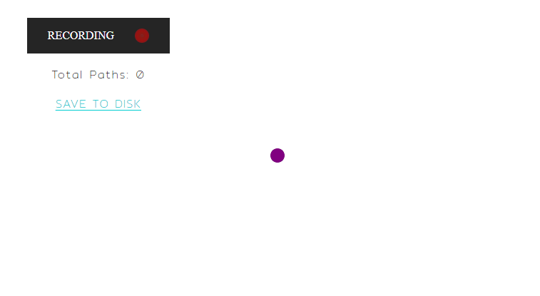

# HumanMouse
_Tool suite designed to manage mouse movement, record and replay human paths within desired bounds._

## Features
- **Cross-platform**, fully supports; Windows, Linux, & MacOS
  
- Record user mouse movement and replay paths 
- Translate paths from reference to local coordinates
- Transform paths to touch a specific screen coordinate
  
- Load and manage collections of paths in JSON format
- Select and combine multiple JSON collections into one
- Manually or Automatically test a collection (configurable)
- Pack JSON paths into a SQLite3 database for use in production

## Details
**For the sole intended purpose of circumventing robot detection:** HumanMouse intends to serve as an *optional* replacement for the variety of existing artifical human mouse-path-generators. An overwhelming majority of these libaries use an approach known as [WindMouse](https://ben.land/post/2021/04/25/windmouse-human-mouse-movement/). This algorthim is over a decade old and widely used. However, depending on your project scope and the importance of obscurity, this may or may not be for you.

### WindMouse
| PROS | CONS |
| :----: | :-----------: |
| No storage  | Old algorithm |
| Quick generation | Potentially detectable |
| &nbsp; | Requires configuration |

### HumanMouse
| PROS | CONS |
| :----: | :-----------: |
| Scalable  | Uses storage |
| Human data | Slower than generation |
| No shared footprints  | Requires collected database |

### Recording
The use of HumanMouse and it's success is dependant on a quality collection of recorded paths. The requirement to ensure quality will vary by task. As a scale of reference: I was able able to collect ~1k paths/hr and to expect desired results a database should contain ~1k paths for ever 1hr of intended run-time. Requiring a minimum of 1k paths and any excess of 100k paths may be redundant.

**Note:** *Additionally when recording your collections, consider the target bounds for production - configure recording environment respectively.*

### Managing

### Production
