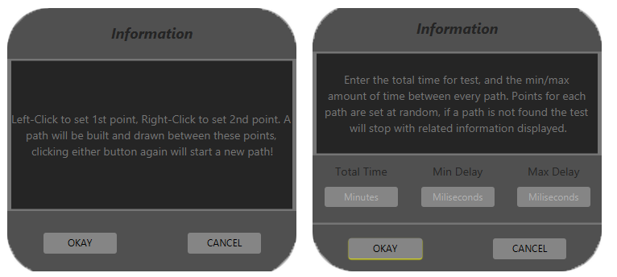

# HumanMouse
_Tool suite designed to manage mouse movement, record and replay human paths within desired bounds._

#### Dependencies
- [SQLite3](https://www.sqlite.org/index.html)

## Features
- **Cross-platform**, fully supports; Windows, Linux, & MacOS
  
- Record user mouse movement and replay paths 
- Translate paths from reference to local coordinates
- Transform paths to touch a specific screen coordinate
  
- Load and manage collections of paths in JSON format
- Select and combine multiple JSON collections into one
- Manually or Automatically test a collection (configurable)
- Pack JSON paths into a SQLite3 database for use in production

## Details
**For the sole intended purpose of circumventing robot detection:** HumanMouse intends to serve as an *optional* replacement for the variety of existing artifical *"human"* mouse-path-generators. An overwhelming majority of these libaries use an approach known as [WindMouse](https://ben.land/post/2021/04/25/windmouse-human-mouse-movement/). Depending on your project scope and the importance of obscurity, this may or may not be for you.

### WindMouse
| PROS | CONS |
| :----: | :-----------: |
| No storage  | Old algorithm |
| Quick generation | Potentially detectable |
|  | Requires configuration |

### HumanMouse
| PROS | CONS |
| :----: | :-----------: |
| Scalable  | Uses storage |
| Human data | Slower than generation |
| Undetectable  | Requires collected database |
| No shared footprints  |  |

### Recording
The use of HumanMouse and it's success is dependant on a quality collection of recorded paths. The requirement to ensure quality will vary by task. As a scale of reference I was able able to collect ~1k paths/hr and, as a rule of thumb, to expect quality results a database should contain ~1k paths for ever 1hr of intended total run-time. Requiring a minimum of 1k paths and any excess of 100k paths may be redundant. 

If a large database is required consider crowd-sourcing, as such a sample [Recorder](https://github.com/EricBallard/HumanMouse/blob/main/src/main/js/recorder/) has been included in Javascript. Regardless the same principles can be applied to record paths in a variety languages, on any platform, targeting any application.

**Note:** *Additionally when recording your collections, consider the target bounds for production and configure recording environment respectively.*

### Managing
Manging a recorded collection of paths has never been easier. Provided in Java, the [Manager](https://github.com/EricBallard/HumanMouse/tree/main/src/main/java/manager), is a one-size-fits-all solution that composes of three main objectives; **Data**, **Verification**, **Debugging**

#### Data
Using the Files button, you are given four options;
| <!-- -->    | <!-- -->    |
|-------------|-------------|
| Merge | Combine multiple JSON collections into one |
| Load | Select and load JSON collection |
| Save | Save loaded collection as JSON |
| Pack | Save loaded collection as SQLite |

#### Verification
Visually verify recorded paths with related information suchs as; index in collection, total time of paths, points, and the x/y difference between start and end point.
Play, pause, repeat, delete, and manually index a collection, dont forget to save changes!

#### Debugging
There are two options availbe for debugging a collection, *manual* and 8automatic*. While debugging a start and end point are set and then an attempt to find potential paths will begin.

While debugging, a path will only be used once as to represent the available variety. Details will be displayed and/or automatic debugging will stop.  

When a path is found the original path, with translation, is drawn in blue. Proceeding this the path will be transformed to touch the target point, and re-drawn in purple! (See first GIF under title)

### Production
Last, but *certainly* not least - Production! 🌟

If you intend to use these methods to reproduce mouse movement in your application it is *recommended* to Pack your collection into an SQLite3 database using `Files -> Pack` in the Manager.  

Although if your runtime use for mouse automation is overall miniscule, or RAM isn't an issue, feel free to parse JSON collection into memory as such your poll time to query a path likely won't exceed 50ms and will be faster than SQLite.  

However if you intend to use a large database or simultaneous instances, use SQLite3! As such poll time to query a path should not exceed 75ms and will be fractionally slower than RAM, yet still acceptably quick, in addition packing will reduce file size by ~ 65%

For examples on how to handle this data, both JSON and SQLite, snippets are provided in Java. Refer to [Database.java](https://github.com/EricBallard/HumanMouse/blob/main/src/main/java/manager/files/Database.java) for SQLite3 and [Files.java](https://github.com/EricBallard/HumanMouse/blob/main/src/main/java/manager/files/Files.java) for JSON!
