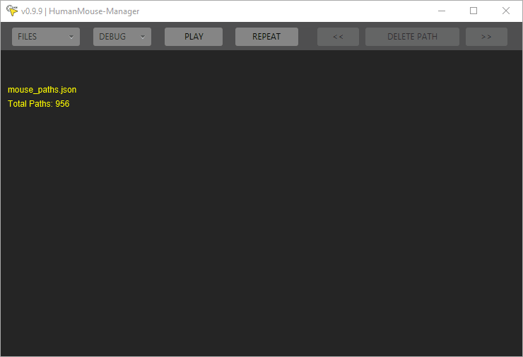

# HumanMouse
_Tool suite designed to manage mouse movement, record and replay human paths within desired bounds._

#### Dependencies
- Java 11+
- [JavaFX](https://openjfx.io/openjfx-docs/#install-javafx)
- [SQLite3](https://www.sqlite.org/index.html)

## Features
- **Cross-platform**, fully supports; Windows, Linux, & MacOS
  
- Record user mouse movement and replay paths 
- Translate paths from reference to local coordinates
- Transform paths to touch a specific screen coordinate
  
- Load and manage collections of paths in JSON format
- Select and combine multiple JSON collections into one
- Manually or Automatically test a collection (configurable)
- Pack JSON paths into a SQLite3 database for use in production

## Details
**For the sole intended purpose of circumventing robot detection:** HumanMouse intends to serve as an *optional* replacement for the variety of existing artifical *"human"* mouse-path-generators. An overwhelming majority of these libaries use an approach known as [WindMouse](https://ben.land/post/2021/04/25/windmouse-human-mouse-movement/). Depending on your project scope and the importance of obscurity, this may or may not be for you.

### WindMouse
| PROS | CONS |
| :----: | :-----------: |
| No storage  | Old algorithm |
| Quick generation | Potentially detectable |
|  | Requires configuration |

### HumanMouse
| PROS | CONS |
| :----: | :-----------: |
| Scalable  | Uses storage |
| Human data | Slower than generation |
| Undetectable  | Requires collected database |
| No shared footprints  |  |

### Recording
The use of HumanMouse and it's success is dependant on a quality collection of recorded paths. The requirement to ensure quality will vary by task. As a scale of reference I was able able to collect ~1k paths/hr and, as a rule of thumb, to expect quality results a database should contain ~1k paths for ever 1hr of intended total run-time. Requiring a minimum of 1k paths and any excess of 100k paths may be redundant. If a large database is required consider crowd-sourcing, as such a sample [Recorder](https://github.com/EricBallard/HumanMouse/blob/main/src/main/js/recorder/) has been included in Javascript. Regardless the same principles can be applied to record paths in a variety languages, on any platform, targeting any application.

**Note:** *Additionally when recording your collections, consider the target bounds for production and configure recording environment respectively.*

### Managing
Manging a recorded collection of paths has never been easier. Provided in Java, the [Manager](https://github.com/EricBallard/HumanMouse/tree/main/src/main/java/manager), is a one-size-fits-all solution that composes of three main objectives; **Data**, **Verification**, **Debugging**

#### Data
Using the Files button, you are given four options;
| <!-- -->    | <!-- -->    |
|-------------|-------------|
| Merge | Combine multiple JSON collections into one |
| Load | Select and load JSON collection |
| Save | Save loaded collection as JSON |
| Pack | Save loaded collection as SQLite |

#### Verification
Visually verify recorded paths with related information suchs as; index in collection, total time of paths, points, and the x/y difference between start and end point.
Play, play, and repeat through a collection with the ability to manually index and delete a path from the collection, dont forget to save after any changes!

#### Debugging

### Production
